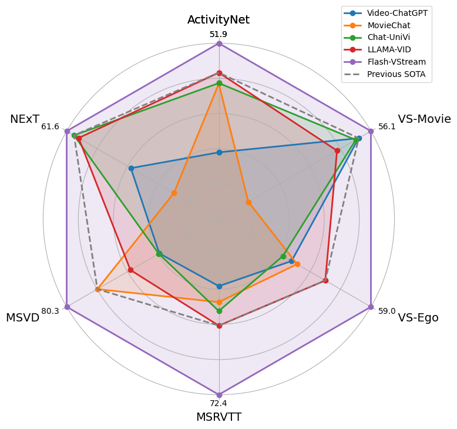
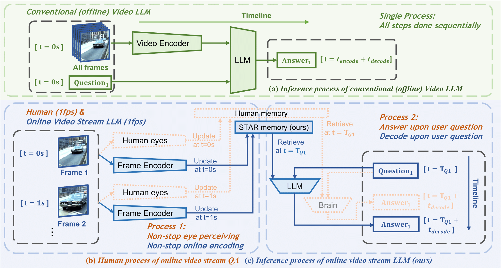

# Flash-VStream: Memory-Based Real-Time Understanding for Long Video Streams


<a href="https://zhang9302002.github.io/">Haoji Zhang</a>\*,
<a href="https://github.com/InvincibleWyq/">Yiqin Wang</a>\*,
<a href="https://andytang15.github.io/">Yansong Tang </a>&dagger;,
<a href="https://yongliu20.github.io/">Yong Liu</a>,
<a href="https://sites.google.com/site/jshfeng/home">Jiashi Feng</a>,
<a href="https://jifengdai.org/">Jifeng Dai</a>,
<a href="https://scholar.google.com.sg/citations?user=OEZ816YAAAAJ&hl=en">Xiaojie Jin</a>&dagger;&Dagger;

\* Equally contributing first authors, †Correspondence, ‡Project Lead

**Work done when interning at Bytedance.**

<a href="https://invinciblewyq.github.io/vstream-page/"></a>
<a href="https://arxiv.org/abs/2406.08085v1"></a>
<a href="https://huggingface.co/spaces/IVGSZ/Flash-VStream-demo"></a>
<a href="https://huggingface.co/IVGSZ/Flash-VStream-7b"></a>
<a href="https://huggingface.co/datasets/IVGSZ/VStream-QA"></a>


<!-- msvd badge -->
[](https://paperswithcode.com/sota/zeroshot-video-question-answer-on-msvd-qa?p=flash-vstream-memory-based-real-time)

<!-- msrvtt badge -->
[](https://paperswithcode.com/sota/zeroshot-video-question-answer-on-msrvtt-qa?p=flash-vstream-memory-based-real-time)

<!-- nextqa badge -->
[](https://paperswithcode.com/sota/question-answering-on-next-qa-open-ended?p=flash-vstream-memory-based-real-time)

<!-- actnetqa badge -->
[](https://paperswithcode.com/sota/zeroshot-video-question-answer-on-activitynet?p=flash-vstream-memory-based-real-time)

<!-- loveu@cvpr'24 challenge badge -->
<a href="https://sites.google.com/view/loveucvpr24/track1"></a>

<!-- loveu@cvpr'24 challenge certification -->
<a href="https://github.com/bytedance/Flash-VStream/assets/37479394/e1496dec-52c8-4707-aabe-fd1970c8f874">
</a>


We presented **Flash-VStream**, a noval LMM able to process extremely long video streams in real-time and respond to user queries simultaneously.

We also proposed **VStream-QA**, a novel question answering benchmark specifically designed for online video streaming understanding.

<p align="center">

</p>
<p align="center">

</p>

## News
- [2024/6/15] 🏅 Our team won the 1st Place at [Long-Term Video Question Answering Challenge](https://sites.google.com/view/loveucvpr24/track1) of [LOVEU Workshop@CVPR'24](https://sites.google.com/view/loveucvpr24/home). Here is our [certification](https://github.com/bytedance/Flash-VStream/assets/37479394/e1496dec-52c8-4707-aabe-fd1970c8f874). 
We used a Hierarchical Memory model based on Flash-VStream-7b.

- [2024/06/12] 🔥 Flash-VStream is coming! We release the 
[homepage](https://invinciblewyq.github.io/vstream-page), 
[paper](https://arxiv.org/abs/2406.08085v1),
[code](https://github.com/IVGSZ/Flash-VStream)
and [model](https://huggingface.co/IVGSZ/Flash-VStream-7b)
for Flash-VStream.
We release the [dataset](https://huggingface.co/datasets/IVGSZ/VStream-QA) for VStream-QA benchmark.

## Contents
- [Install](#install)
- [Model](#model)
- [Preparation](#preparation)
- [Train](#train)
- [Evaluation](#evaluation)
- [Real-time CLI Inference](#Real-time-CLI-Inference)
- [VStream-QA Benchmark](#VStream-QA-Benchmark)
- [Citation](#citation)
- [Acknowledgement](#acknowledgement)
- [License](#license)

## Install
Please follow the instructions below to install the required packages.
1. Clone this repository

2. Install Package
```bash
conda create -n vstream python=3.10 -y
conda activate vstream
cd Flash-VStream
pip install --upgrade pip
pip install -e .
```

3. Install additional packages for training cases
```bash
pip install ninja
pip install flash-attn --no-build-isolation
```

## Model

We provide our Flash-VStream models after Stage 1 and 2 finetuning:

| Model | Weight | Initialized from LLM | Initialized from ViT |
| --- | --- | --- | --- |
| Flash-VStream-7b | [Flash-VStream-7b](https://huggingface.co/IVGSZ/Flash-VStream-7b) | [lmsys/vicuna-7b-v1.5](https://huggingface.co/lmsys/vicuna-7b-v1.5) | [openai/clip-vit-large-patch14](https://huggingface.co/openai/clip-vit-large-patch14) |


## Preparation

### Dataset

**Image VQA Dataset.**
Please organize the training Image VQA training data following [this](https://github.com/haotian-liu/LLaVA/blob/main/docs/Data.md) and evaluation data following [this](https://github.com/haotian-liu/LLaVA/blob/main/docs/Evaluation.md).
Please put the pretraining data, finetuning data, and evaluation data in  `pretrain`, `finetune`, and `eval_video` folder following [Structure](#structure).

**Video VQA Dataset.**
please download the 2.5M subset from [WebVid](https://maxbain.com/webvid-dataset/) and ActivityNet dataset from [official website](http://activity-net.org/download.html) or [video-chatgpt](https://github.com/mbzuai-oryx/Video-ChatGPT/blob/main/docs/train_video_chatgpt.md).

If you want to perform evaluation, please also download corresponding files of 
[ActivityNet-QA](https://github.com/mbzuai-oryx/Video-ChatGPT/blob/main/quantitative_evaluation/README.md) 
and [NExT-QA-OE](https://github.com/doc-doc/NExT-QA).
You can download 
[MSVD-QA](https://mycuhk-my.sharepoint.com/:u:/g/personal/1155186668_link_cuhk_edu_hk/EUNEXqg8pctPq3WZPHb4Fd8BYIxHO5qPCnU6aWsrV1O4JQ?e=guynwu) 
and [MSRVTT-QA](https://mycuhk-my.sharepoint.com/:u:/g/personal/1155186668_link_cuhk_edu_hk/EcEXh1HfTXhLrRnuwHbl15IBJeRop-d50Q90njHmhvLwtA?e=SE24eG) from LLaMA-VID.


**Meta Info.** 
For meta info of training data, please download the following files and organize them as in [Structure](#structure).

| Training Stage | Data file name | Size |
| --- | --- | ---: |
| Pretrain | [llava_558k_with_webvid.json](https://huggingface.co/datasets/YanweiLi/LLaMA-VID-Data) | 254 MB |
| Finetune | [llava_v1_5_mix665k_with_video_chatgpt.json](https://huggingface.co/datasets/YanweiLi/LLaMA-VID-Data) | 860 MB |

For meta info of evaluation data, please reformat each QA list to a json file named `test_qa.json` under [Structure](#structure) with format like this:

```json
[
    {
        "video_id": "v_1QIUV7WYKXg",
        "question": "is the athlete wearing trousers",
        "id": "v_1QIUV7WYKXg_3",
        "answer": "no",
        "answer_type": 3,
        "duration": 9.88
    },
    {
        "video_id": "v_9eniCub7u60",
        "question": "does the girl in black clothes have long hair",
        "id": "v_9eniCub7u60_2",
        "answer": "yes",
        "answer_type": 3,
        "duration": 19.43
    },
]
```

### Pretrained Weights
We recommend users to download the pretrained weights from the following link 
[Vicuna-7b-v1.5](https://huggingface.co/lmsys/vicuna-7b-v1.5), 
[clip-vit-large-patch14](https://huggingface.co/openai/clip-vit-large-patch14), 
and put them in `ckpt` following [Structure](#structure).

### Feature Extraction

We recommend users to extract ViT features of training and evaluation data, which accelerates training and evaluating a lot. If you do so, just replace `.mp4` with `.safetensors` in video filename and put them in `image_features` and `video_features` folder. If not, ignore the `image_features` and `video_features` folder. 

We load video feature at fps=1 and arrange them in the time order.

Each `.safetensors` file should contain a dict like this:

```python
{
    'feature': torch.Tensor() with shape=[256, 1024] for image and shape=[Length, 256, 1024] for video.
}
```


### Structure
The folder structure should be organized as follows before training.

```
Flash-VStream
├── checkpoints-finetune
├── checkpoints-pretrain
├── ckpt
│   ├── clip-vit-large-patch14
│   ├── vicuna-7b-v1.5
├── data
│   ├── pretrain
│   │   ├── llava_558k_with_webvid.json
│   │   ├── image_features
│   │   ├── images
│   │   ├── video_features
│   │   ├── videos
│   ├── finetune
│   │   ├── llava_v1_5_mix665k_with_video_chatgpt.json
│   │   ├── activitynet
│   │   ├── coco
│   │   ├── gqa
│   │   ├── image_features
│   │   │   ├── coco
│   │   │   ├── gqa
│   │   │   ├── ocr_vqa
│   │   │   ├── textvqa
│   │   │   ├── vg
│   │   ├── ocr_vqa
│   │   ├── textvqa
│   │   ├── vg
│   │   ├── video_features
│   │   │   ├── activitynet
│   ├── eval_video
│   │   ├── ActivityNet-QA
│   │   │   ├── video_features
│   │   │   ├── test_qa.json
│   │   ├── MSRVTT-QA
│   │   │   ├── video_features
│   │   │   ├── test_qa.json
│   │   ├── MSVD-QA
│   │   │   ├── video_features
│   │   │   ├── test_qa.json
│   │   ├── nextoe
│   │   │   ├── video_features
│   │   │   ├── test_qa.json
│   │   ├── vstream
│   │   │   ├── video_features
│   │   │   ├── test_qa.json
│   │   ├── vstream-realtime
│   │   │   ├── video_features
│   │   │   ├── test_qa.json
├── flash_vstream
├── scripts

```

## Train
Flash-VStream is trained on 8 A100 GPUs with 80GB memory. To train on fewer GPUs, you can reduce the `per_device_train_batch_size` and increase the `gradient_accumulation_steps` accordingly. Always keep the global batch size the same: `per_device_train_batch_size` x `gradient_accumulation_steps` x `num_gpus`. If your GPUs have less than 80GB memory, you may try ZeRO-2 and ZeRO-3 stages.

Please make sure you download and organize the data following [Preparation](#preparation) before training.

Like LLaVA, Flash-VStream has two training stages: pretrain and finetune. Their checkpoints will be saved in `checkpoints-pretrain` and `checkpoints-finetune` folder. These two stages will take about 15 hours on 8 A100 GPUs in total.

If you want to train Flash-VStream from pretrained LLM and evaluate it, please run the following command:

```bash
bash scripts/train_and_eval.sh
```

## Evaluation
Please make sure you download and organize the data following [Preparation](#preparation) before evaluation.

If you want to evaluate a Flash-VStream model, please run the following command:

```bash
bash scripts/eval.sh
```

## Real-time CLI Inference
We provide a real-time CLI inference script, which simulates video stream input by reading frames of a video file at a fixed frame speed. You can ask any question and get the answer at any timestamp of the video stream. Run the following command and have a try:

```bash
bash scripts/realtime_cli.sh
```

## VStream-QA Benchmark
Please download VStream-QA Benchmark following [this](https://huggingface.co/datasets/IVGSZ/VStream-QA) repo.

## Citation
If you find this project useful in your research, please consider citing:

```
@article{flashvstream,
      title={Flash-VStream: Memory-Based Real-Time Understanding for Long Video Streams}, 
      author={Haoji Zhang and Yiqin Wang and Yansong Tang and Yong Liu and Jiashi Feng and Jifeng Dai and Xiaojie Jin},
      year={2024},
      eprint={2406.08085},
      archivePrefix={arXiv},
      primaryClass={cs.CV}
}
```

## Acknowledgement
We would like to thank the following repos for their great work:

- This work is built upon the [LLaVA](https://github.com/haotian-liu/LLaVA).
- This work utilizes LLMs from [Vicuna](https://github.com/lm-sys/FastChat).
- Some code is borrowed from [LLaMA-VID](https://github.com/dvlab-research/LLaMA-VID).
- We perform video-based evaluation from [Video-ChatGPT](https://github.com/mbzuai-oryx/Video-ChatGPT).

## License
[](LICENSE)

This project is licensed under the [Apache-2.0 License](LICENSE).
