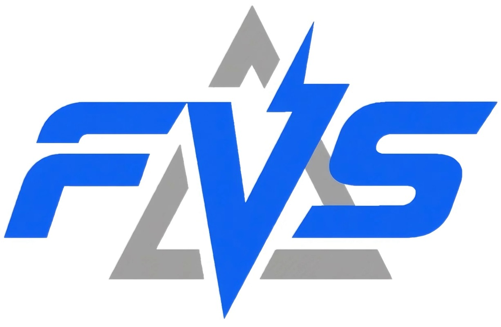

<p align="center">
  
</p>

# [ICCV 2025] Flash-VStream: Efficient Real-Time Understanding for Long Video Streams

<a href="https://zhang9302002.github.io/">Haoji Zhang</a><sup>\*</sup>,
<a href="https://github.com/InvincibleWyq/">Yiqin Wang</a><sup>\*</sup>,
<a href="https://andytang15.github.io/">Yansong Tang</a><sup>&#9993;</sup>,
<a href="https://yongliu20.github.io/">Yong Liu</a>,
<a href="https://sites.google.com/site/jshfeng/home">Jiashi Feng</a>,
<a href="https://scholar.google.com.sg/citations?user=OEZ816YAAAAJ&hl=en">Xiaojie Jin</a><sup>&#9993;&dagger;</sup>

<sup>\*</sup>Equally contributing first authors, 
<sup>&#9993;</sup>Correspondence, 
<sup>&dagger;</sup>Project Leader

**Work done when interning at Bytedance.**

<a href="https://zhang9302002.github.io/vstream-iccv-page/"></a>
<a href="http://arxiv.org/abs/2506.23825"></a>
<a href="https://github.com/IVGSZ/Flash-VStream"></a>
<a href="https://huggingface.co/zhang9302002/Flash-VStream-Qwen-7b"></a>

We proposed **Flash-VStream**, an efficient VLM with a novel Flash Memory mechanism that enables real-time understanding and Q&A of extremely long video streams. Our model achieves outstanding accuracy and efficiency on EgoSchema, MLVU, LVBench, MVBench and Video-MME Benchmarks.


<p align="center">

</p>

## News
- [2025/6/26] 🔥 [ICCV 2025] Flash-VStream-Qwen is coming! We release the 
[homepage](https://zhang9302002.github.io/vstream-iccv-page/),
[paper](http://arxiv.org/abs/2506.23825),
[Code](./Flash-VStream-Qwen), 
and [model](https://huggingface.co/zhang9302002/Flash-VStream-Qwen-7b).

- [2024/6/15] 🏅 Our team won the 1st Place at [Long-Term Video Question Answering Challenge](https://sites.google.com/view/loveucvpr24/track1) of [LOVEU Workshop@CVPR'24](https://sites.google.com/view/loveucvpr24/home). Here is our [certification](https://github.com/bytedance/Flash-VStream/assets/37479394/e1496dec-52c8-4707-aabe-fd1970c8f874). 
We used a Hierarchical Memory model based on Flash-VStream-7b.

- [2024/06/12] Flash-VStream-LLaVA is coming! We release the 
[homepage](https://invinciblewyq.github.io/vstream-page), 
[paper](https://arxiv.org/abs/2406.08085),
[code](./Flash-VStream-LLaVA)
and [model](https://huggingface.co/IVGSZ/Flash-VStream-7b)
for Flash-VStream.
We release the [dataset](https://huggingface.co/datasets/IVGSZ/VStream-QA) for VStream-QA benchmark.


## Contents
- [Flash-VStream-Qwen](#Flash-VStream-Qwen)
- [Flash-VStream-LLaVA](#Flash-VStream-Qwen)
- [Citation](#citation)
- [Acknowledgement](#acknowledgement)
- [License](#license)

## Flash-VStream-Qwen

See [Flash-VStream-Qwen/README.md](Flash-VStream-Qwen/README.md).

## Flash-VStream-LLaVA

See [Flash-VStream-LLaVA/README.md](Flash-VStream-LLaVA/README.md).

## Citation
If you find this project useful in your research, please consider citing:

```
@article{zhang2025flashvstream,
    title={Flash-VStream: Efficient Real-Time Understanding for Long Video Streams}, 
    author={Haoji Zhang and Yiqin Wang and Yansong Tang and Yong Liu and Jiashi Feng and Xiaojie Jin},
    journal={arXiv preprint arXiv:2506.23825},
    year={2025},
}
@article{zhang2024flashvstream,
    title={Flash-vstream: Memory-based real-time understanding for long video streams},
    author={Zhang, Haoji and Wang, Yiqin and Tang, Yansong and Liu, Yong and Feng, Jiashi and Dai, Jifeng and Jin, Xiaojie},
    journal={arXiv preprint arXiv:2406.08085},
    year={2024}
}
```

## Acknowledgement
We would like to thank the following repos for their great work:

- This work is built upon the [LLaVA](https://github.com/haotian-liu/LLaVA).
- This work utilizes LLMs from [Vicuna](https://github.com/lm-sys/FastChat).
- Some code is borrowed from [LLaMA-VID](https://github.com/dvlab-research/LLaMA-VID).
- We perform video-based evaluation from [Video-ChatGPT](https://github.com/mbzuai-oryx/Video-ChatGPT).

## License
[](LICENSE)

This project is licensed under the [Apache-2.0 License](LICENSE).